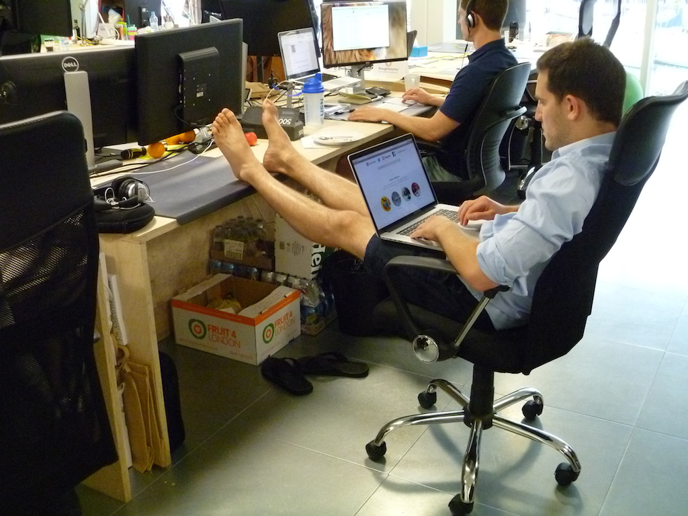

:css: css/presentation.css
:skip-help: true

.. title: My experience 2.5 years among tech startups

----

2.5 YEARS AMONG TECH STARTUPS
==============================
My experience as a Software Engineer
-------------------------------------

Ivan Fraixedes

T: `@ifraixedes`_ // W: ivan.fraixed.es_

.. _@ifraixedes: https://twitter.com/ifraixedes
.. _ivan.fraixed.es: http://ivan.fraixed.es

----

:data-x: 500
:data-y: 780
:data-rotate-z: 90

Let's get a definition of the 2 coolest words
===================================================

- **startup** is a company, a partnership or temporary organisation designed to search for a repeatable and scalable business model
    - **tech-startup** does things relating to microelectronics or anything related to electronics, or digital products such as websites, phone apps, software, cloud services, ...
- **entrepreneur**:  ...... buff.... Several people have given different definitions, so I've taken those:
	- who organizes or operates his/her business or businesses
	- who takes initiative, accept risk of failure
	- who understands their own strengths and weakness

----

:data-x: -800
:data-y: 1500

Hang on, I haven't come to tell theory
=======================================

Internet is full of this and still working better than Google

----

:data-x: -2000
:data-y: 1600

Moreover I'm NOT currently an ENTREPRENEUR so, I'm NOT COOL
============================================================

----

:data-x: -2000
:data-y: 500

But
========

I moved to London and I spent 0.5 years observing entrepreneurs and its startup ecosystem

and
thereafter I've been working for **2 tech-startups** for **2 years**

----

:data-x: 0
:data-y: 1500
:data-rotate-x: 120

Frist one
==========

**One founder** and **nobody else**

I joined as Software Engineer, Developer, DevOps, .... too long, so let's simplify

**"The guy"** who had to create the product and do whatever the product needs to run

.. note::
  Talk about my experience in iWaz.at

----

:data-y: -2000
:data-x: -3000
:data-rotate-z: 720

Second one
===========

**Two founders** and a bunch of guys, they deserve that I call them **"A TEAM"**

We take care, as well as the first one, of everything, but we can balance the work load, share the knowledge, discuss ideas and more!

.. note::
  Talk about my experience in DIGIT

----

:data-rotate-x: -120

My thoughts about working for a **startups**
=============================================

Through my experience in Startups, I've found ...

----

:class: image

Excitement
===========

----

:class: image

Awesome company culture
========================

----

:class: image

People love what they do
=========================

----

:data-rotate-y: 180

What is my perception
=======================

The most of the tech-startups are quite ambitious

Internet have so much influence on them, you can open your business to big amount of customer inside and outside the borders, however the competition is huge.

Due the amount, today entrepreneurs has created their **ecosystems**, which provide help and motivation.

They are used to be **more transparent** than big corporates.

.. note::
  Differences between old entrepreneurs and today ones
  Internet has changed the things
  Ecosystem

    - Provided by others and for that purpose moreover of becoming a new businesses: Co-working spaces, Accelerators, Incubators

    - Indirected and community: Ecosystem, Internet, Crowd funding, Startups providing affordable services, Open source

----

Questions???
============

Please, don't be hard

----

Credits
========

Thanks to my **current team**, and the guy that provided the live chat
 -  Rasthy De Los Reyes, General Manager at Rainmaking Loft (www.rainmakingloft.com_)
 - Charlie Casey, Co-founder of Loyalty Lion (loyaltylion.com_)
 - Deepak Taylor, Founder of Latest Free Stuff (www.latestfreestuff.co.uk_)
 - Oli Johnson, Co-Founder of Small Steps Venture (www.smallstepventures.com_) and Rainmaking Loft (www.rainmakingloft.com_)

Sources
  - Wikipedia_
  - `The Great Startup Wiki`_

.. _www.rainmakingloft.com: http://www.rainmakinglof.com
.. _loyaltylion.com: http://loyaltylion.com
.. _www.latestfreestuff.co.uk: http://www.latestfreestuff.co.uk
.. _www.smallstepventures.com: http://www.smallstepventures.com
.. _Wikipedia: http://wikipedia.org
.. _The Great Startup Wiki: http://thegreatstartupwiki.com
